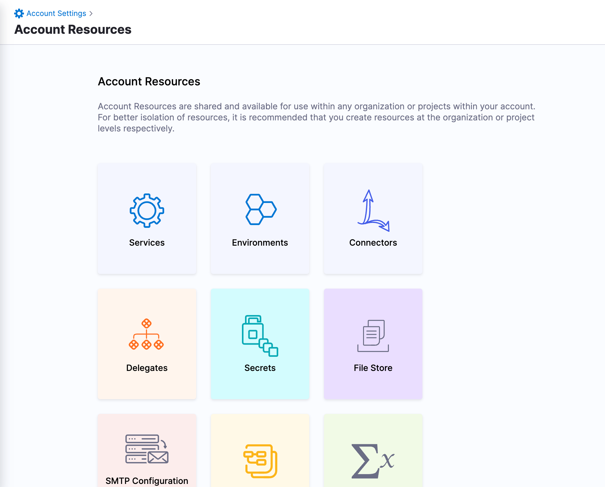
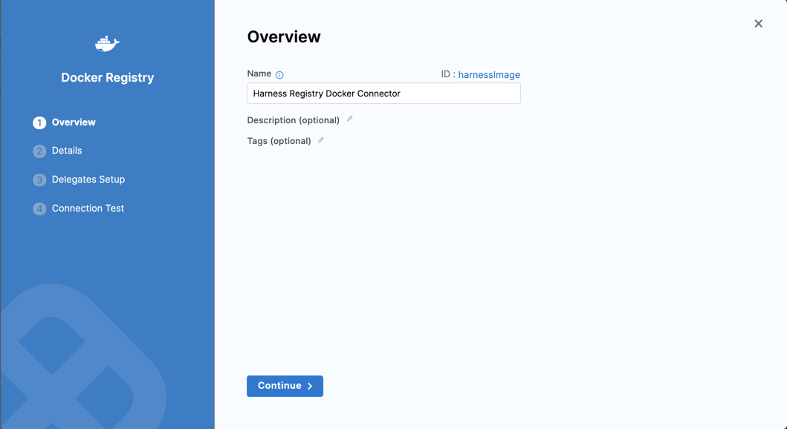
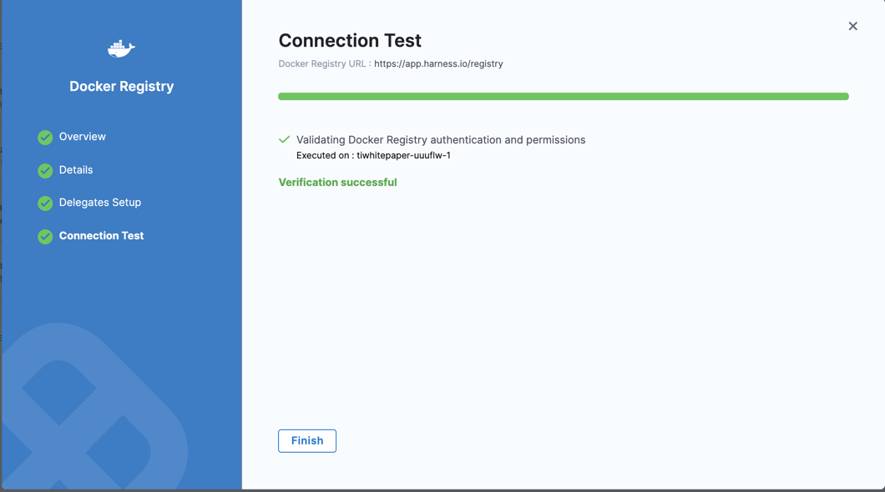

By default, at CIE Pipeline runtime, Harness pulls certain images from public Docker Hub repos. These images are only used for backend processes. At runtime, the Harness Delegate makes an outbound connection to the public repo and pulls the images.

The Harness Container Image Registry is dedicated exclusively to Harness-supported images. You might want to override the default behavior and download your build images from this repo instead. To view the list of images in this registry, enter the following command.

```
curl -X  GET https://app.harness.io/registry/_catalog
```
You can override the default behavior at the Account level and the Stage level:

* **Account-level override:** If you do not want the Harness Delegate to pull images from a public repo for security reasons, you can add a special Harness Connector to your Harness account, and the Delegate will pull these images from the Harness Container Image Registry only.
* **Stage-level override:** You can configure a Build Stage to override the default Delegate and use a dedicated Connector that downloads build images from the Harness Container Image Registry. This is useful when the Delegate cannot access the public repo (for example, if the build infrastructure is running in a private cloud).

Since you and the Harness Delegate are already connected to Harness securely, there are no additional connections to worry about.

:::info

If you choose to override the `harnessImageConnector`, you may also avoid triggering any rate limiting or throttling. This topic explains how to set up the Docker Connector to connect to the Harness Container Image Registry.

:::

### Before you begin

* [CI pipeline basics](../../../continuous-integration/get-started/key-concepts.md)
* [Delegate overview](/docs/platform/delegates/delegate-concepts/delegate-overview.md)
* [Docker Connector Settings Reference](/docs/platform/connectors/cloud-providers/ref-cloud-providers/docker-registry-connector-settings-reference)

### Review: Allowlist app.harness.io

Since you and the Harness Delegate are already connected to Harness securely, app.harness.io should already be allowlisted and there are no additional connections to worry about.

If app.harness.io is not allowlisted, you must allowlist it before proceeding.

:::note

As a general best practice, you should allowlist Harness Domains and IPs. For more information, go to **Allowlist Harness Domains and IPs** in [Delegate system requirements](../../delegates/delegate-concepts/delegate-requirements.md).

:::

### Step 1: Create a Docker connector in Harness

:::note

You must create the Harness Docker Connector at the Account level. Make sure that you have the [permissions](../../role-based-access-control/permissions-reference) to create/edit and view connectors at the Account [scope](../../role-based-access-control/rbac-in-harness#permissions-hierarchy-scopes).

:::

1. In **Account Settings**, **Account Resources**, click **Connectors**.

   

2. Click **New Connector**, and under **Artifact Repositories** click **Docker Registry**.

   

   The Docker Registry Connector settings appear.

   

3. In **Name**, enter a name for this connector.
   Harness automatically generates the corresponding Id ([entity identifier](../../references/entity-identifier-reference.md)).
   If you want to override the account-level connector, modify the Id and set it to `harnessImage`. You must use the Id `harnessImage`.
   Harness gives precedence to the connector with the `harnessImage` identifier, and uses it to pull from the Harness Container Image Registry, as opposed to pulling from Docker Hub directly.
4. Click **Continue**.

### Step 2: Enter credentials

Select or enter the following options:

|  |  |
| --- | --- |
| **Docker Registry URL** | Enter `https://app.harness.io/registry` |
| **Provider Type** | Select **Other (Docker V2 compliant)** |
| **Authentication** | Select **Anonymous (no credentials required)** |

Click **Continue**.

:::tip

By default, Harness uses anonymous access to [Harness Docker Hub](https://hub.docker.com/u/harness) to pull images. If you experience rate limiting issues when pulling images anonymously, select **Username and Password** for **Authentication** and provide login details.

:::

### Step 3: Set Up Delegates

Harness uses Docker Registry Connectors at Pipeline runtime to pull images and perform operations. You can select Any Available Harness Delegate and Harness will select the best delegate at runtime. For a description of how Harness picks delegates, see [Delegate overview](/docs/platform/delegates/delegate-concepts/delegate-overview.md).

You can use delegate tags to select one or more delegates. For details on delegate tags, go to [Use delegates selectors](/docs/platform/delegates/manage-delegates/select-delegates-with-selectors.md).

If you need to install a delegate, go to [Delegate installation overview](../../delegates/install-delegates/overview).

Click **Save and Continue**.

### Step 4: Verify Test Connection

Harness tests the credentials you provided using the delegates you selected.


If the credentials fail, you'll see an error. Click **Edit Credentials** to modify your credentials.

Click **Finish**.

### Step 5: Override the Connector in the Build Stage (*Optional*)

This step is only applicable when you want to override the default Delegate and download build images using the Connector you just created.

In the Build Stage, go to the Infrastructure tab and specify your build-image Connector in the **Override Image Connector** field. The delegate will use this Connector to download images from the Harness repository.


### Step 6: Run the Pipeline

You can now run your Pipeline. Harness will now pull images from the Harness Registry at Pipeline runtime using the configured Connector.

If a connector with`harnessImage` identifier already exists on your **Account**, you need to update the connector instead of creating a new connector.

### See also

* [Permission Reference](../../role-based-access-control/permissions-reference)
* [Harness CI Images](/docs/continuous-integration/use-ci/set-up-build-infrastructure/harness-ci.md)
