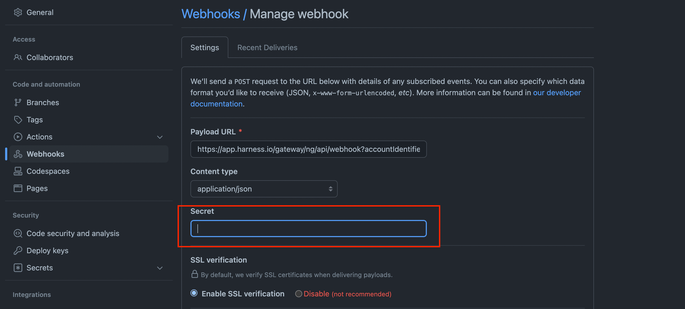
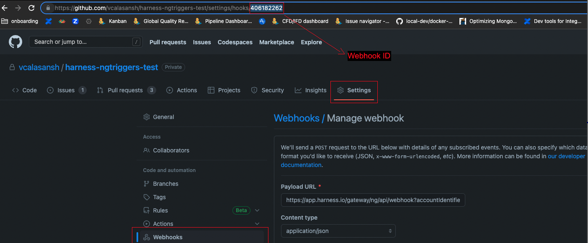
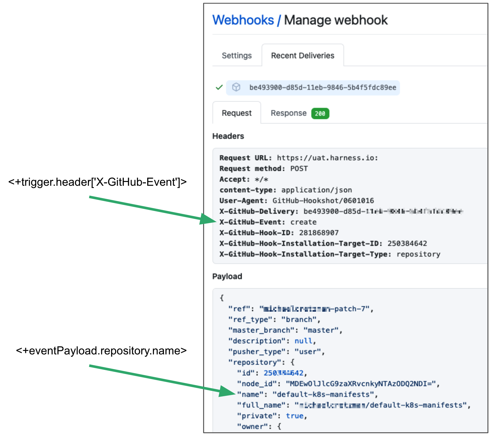
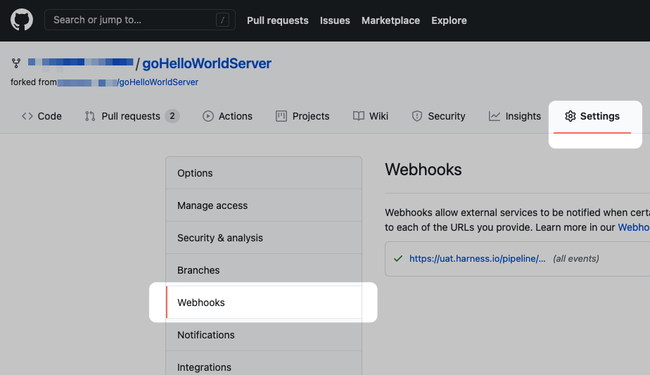

This topic provides settings information for triggers. Triggers are used to initiate the execution of pipelines.

For steps on setting up different types of triggers, go to the [Triggers documentation](/docs/category/triggers).

<details>
<summary>Write triggers in YAML</summary>

There is a YAML editor for triggers. When creating or editing a trigger, switch to **YAML** to access the YAML editor.

Here's an example of the YAML for a trigger.

```yaml
trigger:  
    name: GitlabNewTrigger  
    identifier: GitlabNewTrigger  
    enabled: true  
    description: ""  
    tags: {}  
    orgIdentifier: default  
    projectIdentifier: NewProject  
    pipelineIdentifier: testpp  
    source:  
        type: Webhook  
        spec:  
            type: Gitlab  
            spec:  
                type: MergeRequest  
                spec:  
                    connectorRef: gitlab  
                    autoAbortPreviousExecutions: true  
                    payloadConditions:  
                        - key: <+trigger.payload.user.username>  
                          operator: In  
                          value: john, doe.john  
                    headerConditions:  
                        - key: <+trigger.header['X-Gitlab-Event']>  
                          operator: Equals  
                          value: Merge Request Hook  
                    jexlCondition: (<+trigger.payload.user.username> == "doe" || <+trigger.payload.user.username> == "doe.john") && <+trigger.header['X-Gitlab-Event']> == "Merge Request Hook"  
                    actions: []  
    inputYaml: |  
        pipeline:  
            identifier: testpp  
            properties:  
                ci:  
                    codebase:  
                        build:  
                            type: branch  
                            spec:  
                                branch: <+trigger.branch>  
            variables:  
                - name: testVar  
                  type: String  
                  value: alpine
```

</details>

## Configuration settings

### Trigger object metadata

* **Name** and **Id**: Enter a name for the trigger. Harness automatically assigns an **Id** ([Entity Identifier Reference](../../references/entity-identifier-reference.md)) based on the **Name**. You can change the **Id** until the trigger is saved. Once saved, you can change the name but not the Id.
* **Description**: Optional text string.
* **Tags**: Go to the [Tags Reference](../../references/tags-reference.md).

### Payload Type

Either **Custom** or a Git provider: **Azure**, **GitHub**, **Bitbucket**, **GitLab**.

For the **Custom** payload type, you must create a secure token and add it to your custom Git provider. Whenever you regenerate a secure token, any preceding tokens become invalid, and you must update your Git provider with the new token.

### Connector

Select the [code repo connector](/docs/category/code-repo-connectors) that connects to your Git provider account. The generic Git connector is not supported; you must use a provider-specific connector.

:::info Personal Access Token Permissions

The personal access token used for connector authentication must have the appropriate scopes/permissions.

For example, a GitHub personal access token for a GitHub connector must include all `repo`, `user`, and `admin:repo_hook` options for **Scopes**.

For information about other provider's token scopes, go to:

* [GitLab - Personal access token scopes](https://docs.gitlab.com/ee/user/profile/personal_access_tokens.html#personal-access-token-scopes)
* [Bitbucket Cloud - Repository access token permissions](https://support.atlassian.com/bitbucket-cloud/docs/repository-access-token-permissions/)
* [AWS - Permissions for actions on triggers](https://docs.aws.amazon.com/codecommit/latest/userguide/auth-and-access-control-permissions-reference.html#aa-triggers)

:::

If the connector is for an entire account, rather than a specific repository, you must also enter the **Repository Name** for this trigger.

### Event and Actions

Select Git events and, if applicable, one or more actions that will initiate the trigger.

| **Payload Type** | **Event** | **Actions**                                                                                                                                                                                                       |
| --- | --- |-------------------------------------------------------------------------------------------------------------------------------------------------------------------------------------------------------------------|
| **GitHub** | Pull Request | Select one or more of the following:<ul><li>Close</li><li>Edit</li><li>Open</li><li>Reopen</li><li>Label</li><li>Unlabel</li><li>Synchronize</li></ul>                                                            |
| | Push | GitHub push triggers respond to commit and tag creation actions by default.                                                                                                                                       |
| | Release | Select one or more of the following:<ul><li>Create</li><li>Edit</li><li>Delete</li><li>Prerelease</li><li>Publish</li><li>Release</li><li>Unpublish</li></ul>                                                     |
| | Issue Comment (Only comments on pull requests are supported.) | Select one or more of the following:<ul><li>Created</li><li>Deleted</li><li>Edited</li></ul>                                                                                                                      |
| **GitLab** | Merge Request | Select one or more of the following:<ul><li>Open</li><li>Close</li><li>Reopen</li><li>Merge</li><li>Update</li><li>Sync</li></ul>                                                                                 |
| | Merge Request Comment | Create                                                                                                                                                                                                            |
| | Push | GitLab push triggers respond to commit and tag creation actions by default.                                                                                                                                       |
| **Bitbucket** | Pull Request | Select one or more of the following:<ul><li>Create</li><li>Update</li><li>Merge</li><li>Decline</li></ul>                                                                                                         |
| | Pull Request Comment | Select one or more of the following:<ul><li>Create</li><li>Edit</li><li>Delete</li></ul> Note that this event type is  currently supported only for Bitbucket cloud, and not for Bitbucket on-premises triggers. |
| | Push | Bitbucket Cloud push triggers respond to commit and tag creation actions by default.                                                                                                                              |
| **Azure** | Pull Request | Select one or more of the following:<ul><li>Create</li><li>Update</li><li>Merge</li></ul>                                                                                                                         |
| | Issue Comment | Select one or more of the following:<ul><li>Create</li><li>Edit</li><li>Delete</li></ul>                                                                                                                          |
| | Push | Azure SCM push triggers respond to commit actions by default.                                                                                                                                                     |

Harness uses your Harness account ID to map incoming events. Harness takes the incoming event and compares it to ALL triggers in the account. You can see the event ID that Harness mapped to a trigger in the webhook's event response body `data`, for example:

```
{"status":"SUCCESS","data":"60da52882dc492490c30649e","metaData":null,...
```

Harness maps the `success` status, execution ID, and other information to this event (`data`) ID.

For details on each provider's events, go to:

* [GitHub - Events that trigger workflows](https://docs.github.com/en/actions/reference/events-that-trigger-workflows)
* [GitLab - Events](https://docs.gitlab.com/ee/api/events.html)
* [Bitbucket - Repository events](https://support.atlassian.com/bitbucket-cloud/docs/event-payloads/#Repository-events)

### Auto-abort Previous Execution

Select this option if you want to override active pipeline runs whenever this trigger is activated. By selecting this option, when the branch/PR associated with the trigger receives a newer update that re-triggers the trigger, then any ongoing pipeline runs that were previously started by the same trigger are cancelled before the new pipeline run starts.

Harness uses the following combinations as criteria to identify similar active pipeline runs for **Pull Request** events:

* Account identifier
* Org identifier
* Project identifier
* Pipeline identifier
* Repository URL
* PR number
* Source branch
* Target branch

Harness uses the following combinations as criteria to identify similar active pipeline runs for **Push** events.
* Account identifier
* Org identifier
* Project identifier
* Pipeline identifier
* Repository URL
* Ref (the value of `ref` from the Git push webhook payload)

### Configure Secret

This is an optional setting for additional authentication. You can select a secret for authenticating the webhook call.

For the secret to work with your webhook, you need to configure the repository webhook with the same secret after creating the trigger in Harness.



:::tip Enforce authentication

To enforce authentication for all webhook triggers in a project, you can modify the project's **Default Settings**.

1. In your Harness project, select **Project Setup**, and then select **Default Settings**.
2. Expand the **Pipeline** settings, and then set **Mandate Webhook Secrets for Github Triggers** to **true**.

Now all GitHub webhooks for this project must be authenticated. This means all GitHub triggers, and their associated GitHub repo webhooks, in this project must be configured with a secret. When authenticated in this way, a secret manager with a delegate selector uses the corresponding delegate to decrypt it.

:::

### Polling frequency

:::info note

Currently, this feature is only available for GitHub webhooks, and it is behind the feature flag `CD_GIT_WEBHOOK_POLLING`. Contact [Harness Support](mailto:support@harness.io) to enable the feature.

By default, Harness Git-based triggers listen to Git events using webhooks.

:::

Sometimes webhook events can be missed due to a firewall or a network issue preventing calls from reaching Harness.

To prevent these issues from happening, enter an polling interval in **Polling Frequency**. The polling frequency must be at least two minutes (`2m`) and no more than one hour (`1h`).

You must also enter the GitHub webhook's ID in **Webhook Id**, which can be found at the end of the URL for the GitHub webhook's settings page. If this trigger is new, you will have to get this value after you create the trigger in Harness and allow Harness to automatically create the GitHub webhook.



:::info note

In case the API call using the GitHub retrofit REST client to fetch the webhook events fail, Harness makes a simple cURL request to do the same.

:::

## Conditions settings

Conditions are optional settings you can use to refine the trigger beyond [events and actions](#event-and-actions). These form the overall set of criteria to trigger a pipeline based on changes in a given source.

For example:

* Trigger a pipeline when a specific value is passed in the source payload.
* Trigger a pipeline when there's a change in a specific file or a pull request.
* Trigger a pipeline based on a specific artifact tag convention.

:::info Conditions are cumulative

Triggers are like complex filters in which all conditions are `AND`-ed together. To execute a trigger, the event payload must match *all* trigger conditions.

For example, the configuration in the following image requires that the event match all conditions for **Source Branch**, **Target Branch**, **Header Conditions**, **Payload Conditions**, and **JEXL Conditions** to activate the trigger.


If you want a trigger that uses `OR`, `NOT`, or other operators across the payload, define only a **JEXL Condition** and leave the other conditions empty (unless you want to `AND` them to your JEXL condition).

The JEXL `in` operator is not supported in the **JEXL Condition** field.

:::

With the exception of [JEXL conditions](#jexl-conditions), trigger conditions include an **Attribute**, **Operator**, and **Matches Value**.

### Attributes

Some attributes are predefined and some require you to define a value.

#### Built-in Git payload expressions

To create dynamic triggers, Harness includes built-in Git payload expressions for referencing trigger details, such as a PR number.

* Main expressions:
  * `<+trigger.type>`
    * Webhook
  * `<+trigger.sourceRepo>`
    * Github, Gitlab, Bitbucket, Custom
  * `<+trigger.event>`
    * PR, PUSH, etc.
* PR and Issue Comment expressions
  * `<+trigger.targetBranch>`
  * `<+trigger.sourceBranch>`
  * `<+trigger.prNumber>`
  * `<+trigger.prTitle>`
  * `<+trigger.gitUser>`
  * `<+trigger.repoUrl>`
  * `<+trigger.commitSha>`
  * `<+trigger.baseCommitSha>`
  * `<+trigger.event>`
    * PR, PUSH, etc.
* Push expressions
  * `<+trigger.targetBranch>`
  * `<+trigger.gitUser>`
  * `<+trigger.repoUrl>`
  * `<+trigger.commitSha>`
  * `<+trigger.event>`
    * PR, PUSH, etc.

#### Referencing payload fields

You can reference any payload fields using the expression `<+trigger.payload.[path-in-json]>`, where `[path-in-json]` is the path to the field in the JSON payload, such as `<+trigger.payload.pull_request.user.login>`.

How you reference the path depends on:

* The payload format for the event type. Not all event types use the same payload format.
* The Git provider. Different Git providers send JSON payloads in different formats, even for the same event. For example, a GitHub push payload might be formatted differently than a Bitbucket push payload.

Always make sure the path you use works with the provider's payload format and the event type.

### Operators

Some operators require single values and some operators allow single or multiple values.

Single-value operators include:

* **Equals** and **Not Equals:** Expects a single, full path value.
* **Starts With:** Expects a single value. Harness matches any full path starting with the value.
* **Ends With:** Expects a single value. Harness matches any full path ending with the value.
* **Contains:** Expects a single value. Harness matches any full path containing the value.
* **In** and **Not In:** Allows a single value or multiple comma-separated values. Requires full paths, such as `source/folder1/file1.txt,source/folder2/file2.txt`. For some **Conditions**, you can also use Regex, such as `main,release/.*`. You can use Regex to specify all files in a parent folder, such as `ci/*`.
* **Regex:** Expects a single Regex value. Harness matches full paths based on the Regex. You can use complex Regex expressions, such as `^((?!README\.md).)*$`. You can use this operator to specify multiple paths, and you can use Regex to specify all files in a parent folder, such as `ci/*`.

### Matches Value

Matches values are the values for the trigger to match. Acceptable values and value formatting depend on the condition type, attribute, and operator.

Depending on the attribute and operator, you can supply a single value, comma-separated values, and Regex or JEXL.

### Source Branch, Target Branch, and Changed Files Conditions

You can configure triggers to match the source branch, target branch, and/or changed files in a Git merge. Available conditions depend on the [event type](#event-and-actions) selected. For example, any event that belongs to a merge will have **Source Branch** and **Target Branch** conditions.

For example, the following image shows a trigger that would start a pipeline if both of the following conditions were true:

* The source branch starts with `new-`.
* The target branch equals `main`.


### Header Conditions

In the **Attribute** field, the header expression format is `<+trigger.header['key-name']>`, such as `<+trigger.header['X-GitHub-Event']>`. The following image shows how the expression `<+trigger.header['X-GitHub-Event']>` was derived from the `X-GitHub-Event` key in a GitHub webhook payload.



While valid JSON cannot contain a dash (-), headers are not JSON strings and often contain dashes. For example, `X-Github-Event`  and `content-type` in the following payload:

```json
Request URL: https://app.harness.io:  
Request method: POST  
Accept: */*  
content-type: application/json  
User-Agent: GitHub-Hookshot/0601016  
X-GitHub-Delivery: be493900-000-11eb-000-000  
X-GitHub-Event: create  
X-GitHub-Hook-ID: 281868907  
X-GitHub-Hook-Installation-Target-ID: 250384642  
X-GitHub-Hook-Installation-Target-Type: repository
```

If the header key doesn't contain a dash (`-`), then the following format also works: `<+trigger.header['key name']>`

When Harness evaluates the header key you provide, the comparison is case insensitive.

Depending on the [operator](#operators), In **Matches Value**, you can enter a single value or multiple comma-separated values, and you can use wildcards.

### Payload Conditions

These conditions are based on the values of the webhook's JSON payload. Harness treats the JSON payload as a data model and parses the payload and listens for events on a JSON payload key.

To reference payload values, you use `<+eventPayload.[path-to-key-name]`, for example `<+eventPayload.repository.full_name>`.

For example, here is some data from a webhook payload that shows the repository owner:

```json
...  
>   "repository" : {  
>     "id": 1296269,  
>     "full_name": "octocat/Hello-World",  
>     "owner": {  
>       "login": "octocat",  
>       "id": 1,  
>       ...  
>     },  
...
```

To reference the repository owner in a trigger's payload condition attribute, use the expression `<+eventPayload.repository.owner>`, and enter a matching value in **Matches Value**.

The following image shows how the expression `<+eventPayload.repository.name>` was derived from the `repository:name` key in a GitHub webhook payload.


The following image shows payload conditions that trigger a pipeline if the comment body starts with `This` *and* the repository owner is `johndoe`.


### JEXL Conditions

You can refer to payload data and headers using [JEXL expressions](https://commons.apache.org/proper/commons-jexl/reference/syntax.html). That includes all constants, methods, and operators in [JexlOperator](https://commons.apache.org/proper/commons-jexl/apidocs/org/apache/commons/jexl3/JexlOperator.html).

Be careful when you combine Harness variables and JEXL expressions:

* **Invalid expression format:** `<+pipeline.variables.MAGIC.toLowerCase()>`
  * This expression is ambiguous. It could be evaluated as a Harness variable (return the value of variable `pipeline.variables.MAGIC.toLowerCase()`) or as a JEXL operation (return the lowercase of literal string `pipeline.variables.MAGIC`).
* **Valid expression format:** `<+<+pipeline.variables.MAGIC>.toLowerCase()>`
  * First, this expression gets the value of the variable `pipeline.variables.MAGIC`, and then it returns the value converted to all lowercase.

Here are some examples of valid combined JEXL and Harness expressions:

* `<+trigger.payload.pull_request.diff_url>.contains("triggerNgDemo")`
* `<+trigger.payload.pull_request.diff_url>.contains("triggerNgDemo") || <+trigger.payload.repository.owner.name> == "wings-software"`
* `<+trigger.payload.pull_request.diff_url>.contains("triggerNgDemo") && (<+trigger.payload.repository.owner.name> == "wings-software" || <+trigger.payload.repository.owner.name> == "harness")`

:::tip OR and NOT conditions

Triggers are like complex filters in which all conditions (Payload, header, branch, file, and JEXL) are `AND`-ed together. To execute a trigger, the event payload must match *all* trigger conditions.

If you want a trigger that uses `OR`, `NOT`, or other operators across the payload, define only a **JEXL Condition** and leave the other conditions empty (unless you want to `AND` them to your JEXL condition).

The JEXL `in` operator is not supported in the **JEXL Condition** field.

:::

## Pipeline Input

You can specify [runtime inputs](../run-pipelines-using-input-sets-and-overlays.md) for the trigger to use, such as Harness Service and artifact.

You can use [built-in Git payload expressions](#built-in-git-payload-expressions) and [JEXL expressions](#jexl-conditions) in this setting.

When Git Experience is enabled for your Pipeline, the **Pipeline Input** tab includes the **Pipeline Reference Branch** field. This field is set to `<+trigger.branch>` by default. Any build started by this trigger uses the pipeline and Input Set definitions in the branch specified in the webhook payload. This default is applicable for webhook-based triggers only. For all other trigger types, you must enter a specific branch name.

## Webhook registration

For all Git providers supported by Harness, a webhook is automatically created in the repo. Usually, the webhook is automatically registered. If automatic registration fails, you can [manually register the webhook](#manual-and-custom-webhook-registration).

For each repo, Harness creates one webhook with a superset of all permissions, rather than separate webhooks for each Git event type. The following Git events are included in the webhooks that Harness registers.

```mdx-code-block
import Tabs from '@theme/Tabs';
import TabItem from '@theme/TabItem';
```
```mdx-code-block
<Tabs>
  <TabItem value="github" label="GitHub" default>
```

[GitHub events](https://docs.github.com/en/developers/webhooks-and-events/webhooks/webhook-events-and-payloads):

* `create`
* `push`
* `delete`
* `deployment`
* `pull_request`
* `pull_request_review`

```mdx-code-block
  </TabItem>
  <TabItem value="gitlab" label="GitLab">
```

[GitLab events](https://docs.gitlab.com/ee/user/project/integrations/webhooks.html):

* Comment events
* Issue events
* Merge request events
* Push events

```mdx-code-block
  </TabItem>
  <TabItem value="Bitbucket" label="Bitbucket">
```

* [Bitbucket Cloud events](https://support.atlassian.com/bitbucket-cloud/docs/event-payloads/):
  * `issue`
  * `pull request`
* [Bitbucket Server events](https://confluence.atlassian.com/bitbucketserver/event-payload-938025882.html):
  * Pull requests
  * Branch push tag

```mdx-code-block
  </TabItem>
</Tabs>
```

### Manual and custom webhook registration

Use the manual webhook registration process if automatic webhook registration fails or is impossible (as with custom webhooks).

:::info Webhook registration permissions

You must have the appropriate level of access to configure repo webhooks in your Git provider, and the personal access token used for [code repo connector](/docs/category/code-repo-connectors) authentication must have the appropriate scopes/permissions.

For example, for GitHub, you must be a repo admin and the GitHub personal access token used in the pipeline's GitHub connector must include all `repo`, `user`, and `admin:repo_hook` options for **Scopes**.

For information about other provider's token scopes, go to:

* [GitLab - Personal access token scopes](https://docs.gitlab.com/ee/user/profile/personal_access_tokens.html#personal-access-token-scopes)
* [Bitbucket Cloud - Repository access token permissions](https://support.atlassian.com/bitbucket-cloud/docs/repository-access-token-permissions/)
* [AWS - Permissions for actions on triggers](https://docs.aws.amazon.com/codecommit/latest/userguide/auth-and-access-control-permissions-reference.html#aa-triggers)

:::

:::info note
Harness Self-Managed Enterprise Edition does not support webhook triggers for Helm-based installations using self-signed certificates.
:::

1. In Harness, obtain the trigger webhook by selecting the **Webhook/Link** icon in the list of triggers.

   

2. Log in to your Git provider and navigate to the repo's webhook settings. For example, here's the **Webhooks** section of GitHub.

  

3. Add a webhook. In the webhook settings, paste the webhook URL that you copied from Harness into the payload URL setting in the repo. Make sure that you select JSON for the content type. For example, in GitHub, you select **application/json** in **Content type**.

:::info Custom webhook URL format

The format for the custom webhook URL is `https://app.harness.io/pipeline/api/webhook/custom?accountIdentifier=ACCOUNT_ID&orgIdentifier=ORG_ID&projectIdentifier=PROJECT_ID&pipelineIdentifier=PIPELINE_ID&triggerIdentifier=TRIGGER_ID`

The `orgIdentifier` and `projectIdentifier` are mandatory.

The `pipelineIdentifier` and `triggerIdentifier` target the webhook at the specific pipeline and trigger.

In some cases, you won't want to target the webhook at the specific pipeline and trigger. For example, there are events in GitHub that are not covered by Harness and you might want to set up a custom trigger for those events that applies to all pipelines and their triggers in a project. To instruct Harness to evaluate the custom trigger against all pipelines (until it finds matching **Conditions**), remove `pipelineIdentifier` and `triggerIdentifier` from the URL before adding the trigger to your repo.

:::

## Last Activation

On the list of triggers for a pipeline, you can see when each trigger was last activated.

**Activation** means the trigger was able to *request* pipeline execution; it doesn't mean that the webhook didn't work.

**Failed** usually means the pipeline has a configuration issue that prevented the trigger from initiating a pipeline.
